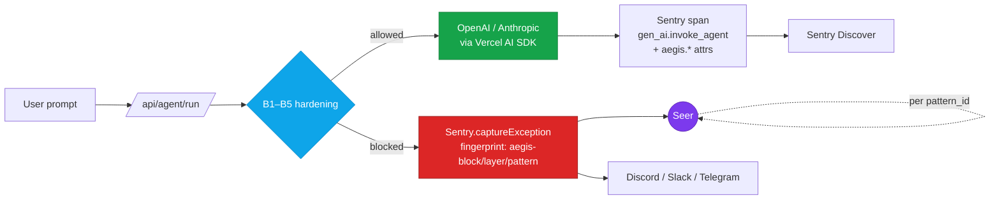
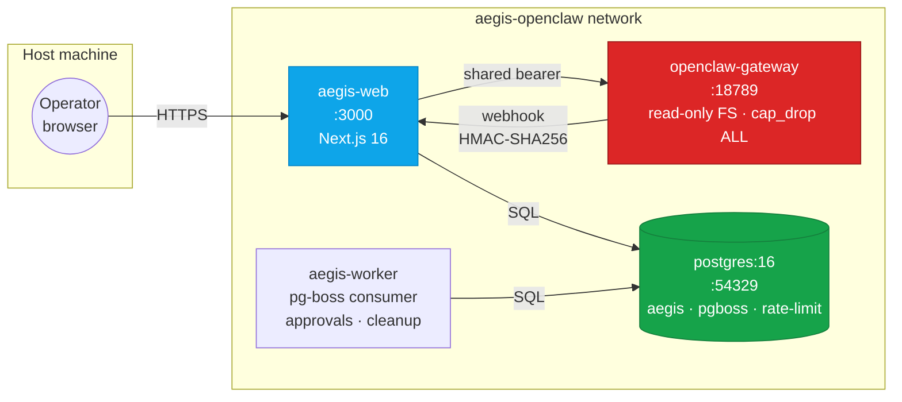
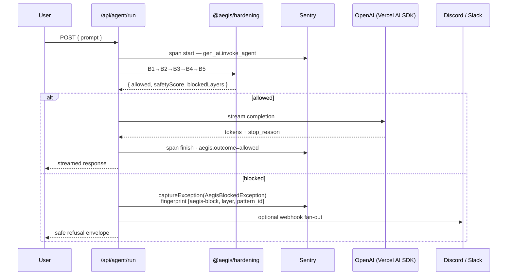

<div align="center">

# 🛡 Ægis — Observable Agentic Hardening

**Five-layer defense middleware for OpenAI agents. Every violation becomes a Sentry exception. Seer analyses it like a production bug.**

[](./LICENSE)
[](./package.json)
[](./package.json)
[](./package.json)
[](./src/instrumentation.ts)
[](https://codex-hackathons.com/hackathons/codex-vienna-2026-04-18)

**Live demo:** _self-host only — see Docker guide below_ · **Video:** [`demo.mp4`](./demo.mp4) · **Submission:** [`docs/submission-description.md`](docs/submission-description.md)

</div>

> **Project status — hackathon prototype.** Built in 6 hours on 2026-04-18 at the
> Codex Vienna Hackathon. Not actively maintained. Issues and PRs may go
> unanswered. The code is public for reference and learning — self-host at your
> own risk.

---

## Why Ægis

Most agent demos show what an LLM can do. Ægis shows what it refuses to do — as Sentry spans you can query and fingerprinted issues Seer can reason about.



---

## Table of contents

- [For judges — 60-second tour](#for-judges--60-second-tour)
- [The 5 layers](#the-5-layers)
- [Sentry integration](#sentry-integration)
- [Quickstart](#quickstart)
- [Docker Compose — Phase-2 stack](#docker-compose--phase-2-stack)
- [Self-host on any VPS](#self-host-on-any-vps)
- [Packages](#packages)
- [API surface](#api-surface)
- [Security posture](#security-posture)
- [Configuration](#configuration)
- [Attack library](#attack-library)
- [Architecture](#architecture)
- [Phase roadmap](#phase-roadmap)
- [Stack & team](#stack--team)
- [Contributing, security, license](#contributing-security-license)

---

## For judges — 60-second tour

1. Open **[aegis-codex.vercel.app](https://aegis-codex.vercel.app)** → navigate to **Testbed**.
2. Click any of the 10 canonical attacks (e.g. `path-traversal-001`, `secret-exfil-001`).
3. Watch: Flow visualization renders the blocked layer, the Sentry issue link opens to a fingerprinted exception, and the `gen_ai.invoke_agent` span shows `aegis.outcome=blocked` with the offending layer.

The attack shows up in Sentry Discover within a few seconds; Seer groups repeats by `pattern_id`.

Full eval matrix: [`docs/eval-matrix.md`](docs/eval-matrix.md). Submission copy: [`docs/submission-description.md`](docs/submission-description.md).

---

## The 5 layers

Defence-in-depth — each layer is a pure function over `{ prompt, context }` returning a decision + safety score. Independently toggleable via `AEGIS_LAYER_B*` env flags. Public API: `createHardening()` from `@aegis/hardening`.

| Layer | Module | Purpose |
|-------|--------|---------|
| **B1 — Paths** | [`paths.ts`](packages/hardening/src/paths.ts) | Blocks path-traversal (`../`, absolute paths outside scope) |
| **B2 — PII** | [`pii.ts`](packages/hardening/src/pii.ts) | Refuses prompts leaking personal data (email, phone, IBAN, SSN) |
| **B3 — Refs** | [`refs.ts`](packages/hardening/src/refs.ts) | Validates grounding references; rejects hallucinated citations |
| **B4 — Injection** | [`security.ts`](packages/hardening/src/security.ts) | Catches prompt injection, destructive commands, exploration spirals |
| **B5 — Redaction** | [`redaction.ts`](packages/hardening/src/redaction.ts) | Redacts vendor secrets / API keys before the prompt leaves the process |

Composable via `createHardening({ flags })` → `{ allowed, safetyScore, blockedLayers, redactedPrompt, piiDetected, injectionDetected, destructiveCount }`.

---

## Sentry integration

Ægis is built on `@sentry/nextjs` v8 with `Sentry.vercelAIIntegration()` (the v8 name for the OpenAI / Vercel-AI-SDK auto-instrumentation — see [`src/instrumentation.ts`](src/instrumentation.ts)) plus a custom [`AegisSentryIntegration`](packages/sentry-integration/) that enriches events with Ægis-specific tags.

**Auto-instrumented LLM spans.** Every `gpt-4o-mini` / `gpt-5` / `claude-haiku` completion emits a `gen_ai.invoke_agent` span with token counts, cost, model, and stop reason.

**Custom `aegis.*` attributes** — queryable in Sentry Discover, defined in [`src/lib/sentry-contract.ts`](src/lib/sentry-contract.ts):

| Attribute | Type | Set on |
|-----------|------|--------|
| `aegis.safety_score` | number `0–1` | every span |
| `aegis.blocked_layers` | comma-separated layer ids | every span |
| `aegis.outcome` | `"allowed"` \| `"blocked"` | every span |
| `aegis.pii_detected` | boolean | every span |
| `aegis.injection_detected` | boolean | every span |
| `aegis.destructive_count` | integer | every span |
| `aegis.layer`, `aegis.summary` | derived tags | blocked events (via `AegisSentryIntegration`) |

**`captureException` with fingerprint → Seer.** When a layer blocks, `AegisBlockedException` is captured with `fingerprint: ['aegis-block', layer, pattern_id]`. Sentry groups attacks by pattern; Seer receives the issue and proposes a fix, same as for any other exception.

**`beforeSend` redaction** strips PII and secrets before events leave the process.

---

## Quickstart

### 30-second version (hosted model, no DB)

```bash
pnpm install
cp .env.example .env.local   # fill OPENAI_API_KEY + NEXT_PUBLIC_SENTRY_DSN
pnpm dev                     # http://localhost:3000
```

**Prerequisites:** Node.js ≥ 24 · pnpm ≥ 10 · free Sentry account · OpenAI key.
Anthropic is optional (only used by the A/B compare view).

**Dev-server restart** is required after any `.env*` change — Next.js reads env only at boot.

### Quality gates

```bash
pnpm typecheck   # tsgo --noEmit — 0 errors mandatory
pnpm lint        # ESLint 9   — 0 errors mandatory
pnpm test        # Vitest     — all passing
```

---

## Docker Compose — Phase-2 stack

Full stack in one command (Next.js web · pg-boss worker · OpenClaw gateway · Postgres):

```bash
cp docker/.env.example docker/.env   # fill OPENCLAW_GATEWAY_TOKEN, AEGIS_SHARED_TOKEN, model keys
docker compose -f docker/docker-compose.yml --env-file docker/.env up --build
```



| Service | Port | Responsibilities |
|---------|------|------------------|
| `aegis-web` | `3000` | Next.js app — dashboard, testbed, API surface, Sentry instrumentation |
| `aegis-worker` | — | pg-boss consumer: approval TTL, rate-limit cleanup, dead-letter sweeps |
| `openclaw-gateway` | `18789` | Runtime approval bridge; `read_only: true`, `cap_drop: [ALL]`, `no-new-privileges`, `tmpfs:/tmp` |
| `postgres` | `54329 → 5432` | Shared DB: `aegis` schema (sessions, approvals), `pgboss` schema (queues), rate-limit buckets |

Details, build profiles (`dev` / `production`), and Codex-OAuth seeding: [`docker/README.md`](docker/README.md).

---

## Self-host on any VPS

The Compose stack above runs anywhere Docker does. The full step-by-step
production-grade deploy guide — secrets generation, reverse proxy + TLS, port
isolation, health checks, day-2 ops, clean tear-down — lives at
**[`docs/self-host.md`](docs/self-host.md)**.

```bash
# On a fresh Linux VPS with Docker installed
rsync -avz --exclude node_modules --exclude .next --exclude .git \
  ./ you@your-vps:~/aegis/

ssh you@your-vps
cd ~/aegis
cp docker/.env.example docker/.env   # set AEGIS_BUILD_PROFILE=production + secrets
docker compose -f docker/docker-compose.yml --env-file docker/.env up -d --build
```

Then point a reverse proxy (Caddy / nginx) at `127.0.0.1:3000` and add an A-record.
Tear-down is a one-liner: `docker compose down -v && rm -rf ~/aegis`.

> Use this path (not Vercel) when you want Phase-2 features end-to-end (OpenClaw,
> Postgres, pg-boss approvals) or need `@aegis/sandbox` (gondolin requires KVM/QEMU).

---

## Packages

| Package | Purpose |
|---------|---------|
| [`@aegis/hardening`](packages/hardening) | 5-layer defence core — pure, deterministic, SDK-free |
| [`@aegis/types`](packages/types) | Shared TypeScript types + Zod schemas |
| [`@aegis/sentry-integration`](packages/sentry-integration) | `AegisSentryIntegration` — tag enrichment + `beforeSend` redaction |
| [`@aegis/openclaw-client`](packages/openclaw-client) | Typed OpenClaw client: `chatModel()`, `resolveApproval()`, `verifyWebhookSignature()` |
| [`@aegis/sandbox`](packages/sandbox) | Phase-3 preview — gondolin QEMU microVM wrapper with safe fallback |

Post-hackathon, each will publish as an independent package under `@aegis/*` on npm.

---

## API surface

| Route | Purpose | Guards |
|-------|---------|--------|
| `POST /api/agent/run` | Core hardened agent path (demo default) | B1–B5, rate-limit, Sentry span |
| `POST /api/chat/stream` | Streamed operator chat | B1–B5, auth, rate-limit, Sentry span |
| `POST /api/testbed/fire` | Fires one of 10 canonical attacks | public (read-only), Sentry span |
| `POST /api/compare` | A/B OpenAI vs. Anthropic | auth, B1–B5 on both legs |
| `GET  /api/approvals` · `POST /api/approvals/[id]/decide` | Approval queue + decision | auth, B1–B5 on reason, rate-limit |
| `POST /api/webhook/openclaw` · `POST /api/webhook/sentry` | Inbound webhooks | HMAC-SHA256, no cookie |
| `POST /api/runtime/openclaw/approval-requests[/[id]/decisions]` | OpenClaw bridge in/out | shared bearer token |
| `GET  /api/runtime/openclaw/health` | Gateway preflight | shared bearer token |
| `POST /api/sandbox/demo` | Phase-3 preview — sandboxed tool call | feature-flagged |
| `GET  /api/metrics` | Dashboard live counts (5 s poll) | public (aggregate only) |
| `GET  /api/health` · `GET /api/ready` | Liveness / readiness | public |
| `POST /api/auth/login` · `POST /api/auth/logout` · `GET /api/auth/me` | Session auth (HMAC-signed httpOnly cookie) | rate-limit |
| `GET/POST /api/sessions[/[id]]` | Chat session CRUD | auth, rate-limit |

Every mutating route emits a Sentry span with the full `aegis.*` attribute set.

---

## Security posture

Ægis is a public prototype — trust boundaries are explicit:

| Boundary | Strict in prod | Loose in demo (why) |
|----------|----------------|----------------------|
| Rate limiting (`src/lib/rate-limit.ts`) | Postgres-backed leaky-bucket | Demo defaults 500/3000/6000/2000 per 60 s; `AEGIS_DEMO_MODE=true` or `AEGIS_RATE_LIMIT_BYPASS=true` short-circuits the DB call — **Sentry `aegis.ratelimited` telemetry stays wired** |
| Auth | HMAC-signed `httpOnly` session cookie, bcrypt(12) passphrase hash | Docker default `AEGIS_DEMO_DISABLE_AUTH=true` for the approvals demo surface |
| Webhook ingress | HMAC-SHA256 verification (`verifyWebhookSignature`) before any state change | same — never loose |
| OpenClaw gateway | `read_only: true` root FS · `cap_drop: [ALL]` · `no-new-privileges` · unprivileged user · immutable `exec-approvals.json` | same — never loose |
| LLM output | B1–B5 + `beforeSend` PII/secret redaction | same — never loose |
| Secrets | `.env.local` only (git-ignored); `.gitleaks.toml` + `secret-scan.yml` in CI | same — never loose |
| Sandbox egress (`@aegis/sandbox`) | gondolin QEMU microVM + host allowlist | Phase-3 preview; no-op fallback when QEMU unavailable |

**Demo-mode circuit-breaker** (`AEGIS_DEMO_MODE=true`) returns deterministic scripted hardening results — use only if the live demo breaks mid-presentation. Sentry stays fully wired.

Full policy: [`SECURITY.md`](SECURITY.md).

---

## Configuration

Copy `.env.example` → `.env.local`. Minimum required:

| Variable | Required | Purpose |
|----------|----------|---------|
| `OPENAI_API_KEY` | yes | Primary LLM (`gpt-4o-mini` default) |
| `ANTHROPIC_API_KEY` | compare view | Claude A/B leg (`claude-haiku-4-5-20251001`) |
| `NEXT_PUBLIC_SENTRY_DSN` · `SENTRY_DSN` | yes | Client + server DSN — must match the org `SENTRY_AUTH_TOKEN` can access |
| `SENTRY_ORG` · `SENTRY_PROJECT` | yes | Org + project slugs |
| `SENTRY_AUTH_TOKEN` | source-maps only | Build-time source-map upload |
| `NEXT_PUBLIC_SENTRY_ENABLED` | yes | `true` to enable Sentry in dev |
| `AEGIS_LAYER_B1_PATHS` … `B5_REDACTION` | optional | Per-layer kill-switch; all default `true` |

Phase-2 extras (`OPENCLAW_*`, `SUPABASE_*`, `DATABASE_URL`, `PGBOSS_SCHEMA`, `AEGIS_SESSION_*`, `DISCORD_WEBHOOK_URL`, `UPSTASH_REDIS_*`): see [`.env.example`](.env.example).

**Sentry provisioning & DSN org check:** [`docs/setup-troubleshooting.md`](docs/setup-troubleshooting.md) — if the Sentry UI stays empty after firing an attack, the DSN belongs to a different org than your auth token. That doc covers token-based project creation + a one-liner DSN probe.

---

## Attack library

Ten canonical attacks drive the Testbed UI and the eval matrix. Each has a stable `pattern_id` used as the third fingerprint segment, so Seer groups repeats like a recurring production bug.

| id | Category | Expected block |
|---|---|---|
| `path-traversal-001` · `-002` | File access | **B1** |
| `pii-leak-001` · `-002` | PII exposure | **B2** |
| `hallucinated-refs-001` · `-002` | Grounding | **B3** (soft) |
| `prompt-injection-001` · `-002` | Injection / role-swap | **B4** |
| `secret-exfil-001` · `-002` | Secret exfiltration | **B4** |

Full matrix with prompts, reasons, and expected outcomes: [`docs/eval-matrix.md`](docs/eval-matrix.md).

---

## Architecture

Full design document with sequence diagrams (chat, approvals, denial path, persistence, deployment topology): [`docs/architecture.md`](docs/architecture.md).

Core `/api/agent/run` sequence:



---

## Phase roadmap

| Phase | Scope | Status |
|-------|-------|--------|
| **1 — Shield** | 5-layer hardening · live dashboard · Sentry full-stack · webhook fan-out | **Live today** |
| **2 — Seer-Loop** | Operator chat · approval queue · OpenClaw bridge · pg-boss persistence · signed webhooks | Implemented, documented in [`docs/architecture.md`](docs/architecture.md) & [`docs/PHASE-2-SEER-VISION.md`](docs/PHASE-2-SEER-VISION.md) |
| **3 — Auto-Remediation** | `@aegis/sandbox` (gondolin microVM) · Seer → MR flow · agent patches guarded by Ægis itself | Designed — ADR §1, PoC on `main` (Vercel-incompatible; needs self-hosted worker) |

---

## Stack & team

**Stack.** Next.js 16 · React 19 · Tailwind CSS 4 · shadcn/ui (Lyra) · OpenAI `gpt-4o-mini` via Vercel AI SDK · Anthropic `claude-haiku-4-5-20251001` · `@sentry/nextjs` v8 with `vercelAIIntegration()` · Postgres 16 · `pg-boss` 10 · pnpm workspace · Vercel deploy.

**Team.** Four humans, hundreds of agents, six hours, one Vienna afternoon.
[@apetersson](https://github.com/apetersson) ·
[@ErmisCho](https://github.com/ErmisCho) ·
[@Kanevry](https://github.com/Kanevry) ·
[@topsrek](https://github.com/topsrek)

**Event.** [Codex Community Hackathon Vienna](https://codex-hackathons.com/hackathons/codex-vienna-2026-04-18) — 2026-04-18, 11:00–17:00 CEST. The hardening core (`@aegis/hardening`) is ported from a first-place prior hackathon entry, adapted for Node/Next and extended with full Sentry observability.

The jury-relevant tracks are **Agentic Coding** (we built with Codex CLI) and **Building Evals** (the 10-attack library + safety-score matrix).

---

## Contributing, security, license

- Architecture deep-dive: [`docs/architecture.md`](docs/architecture.md)
- ADR (Phase-2 direction): [`docs/ADR.md`](docs/ADR.md)
- Phase-2 Seer vision: [`docs/PHASE-2-SEER-VISION.md`](docs/PHASE-2-SEER-VISION.md)
- OpenClaw setup: [`docs/OPENCLAW_SETUP.md`](docs/OPENCLAW_SETUP.md)
- Setup troubleshooting (Sentry DSN/token checks): [`docs/setup-troubleshooting.md`](docs/setup-troubleshooting.md)
- E2E smoke checklist: [`docs/e2e-smoke-checklist.md`](docs/e2e-smoke-checklist.md)
- Deploy notes (Vercel): [`docs/deploy.md`](docs/deploy.md)
- Self-host on a VPS: [`docs/self-host.md`](docs/self-host.md)
- Contributing: [`CONTRIBUTING.md`](CONTRIBUTING.md) · Code of Conduct: [`CODE_OF_CONDUCT.md`](CODE_OF_CONDUCT.md) · Security: [`SECURITY.md`](SECURITY.md)
- Blog: [`docs/blog/observable-agentic-hardening.md`](docs/blog/observable-agentic-hardening.md) · Retro: [`docs/retro/2026-04-18-hackathon-retro.md`](docs/retro/2026-04-18-hackathon-retro.md)

**License.** MIT — see [`LICENSE`](LICENSE).

---

## Links

- Hackathon: https://codex-hackathons.com/hackathons/codex-vienna-2026-04-18
- Sentry AI Agent Monitoring: https://blog.sentry.io/sentrys-updated-agent-monitoring/
- Live demo: https://aegis-codex.vercel.app
- Repository: https://github.com/Kanevry/aegis
