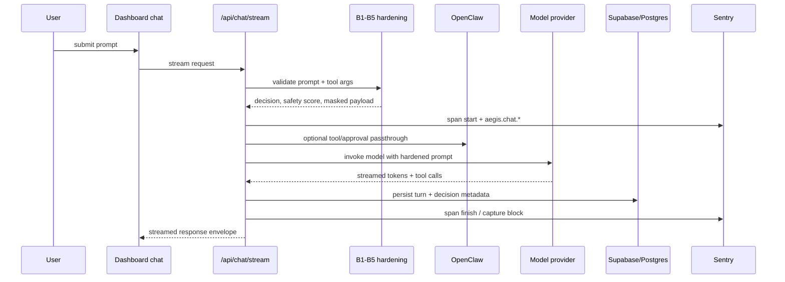
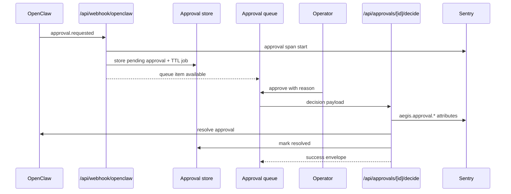
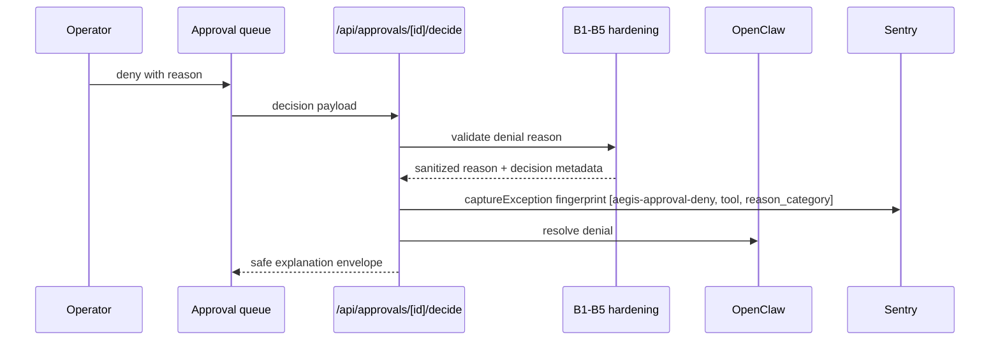
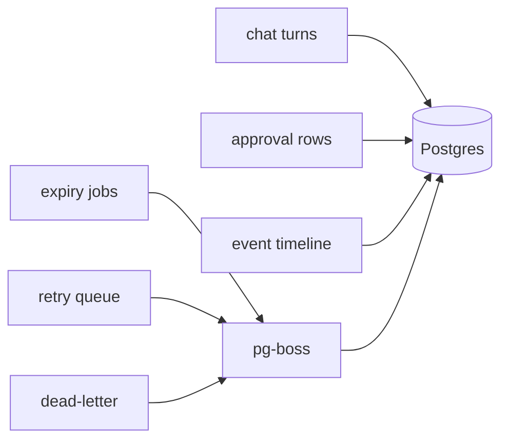

# Aegis Architecture

Phase 2 turns the Phase 1 demo into an operator-facing chat and approval system with Sentry-native observability. This document summarizes the target design, the boundaries we care about, and the issue map that drives the work.

## 1. Problem and solution

Phase 1 proved that Aegis can harden a single route and emit useful Sentry data. Phase 2 expands that into a full chat workflow where every prompt, tool request, approval, and denial stays observable and explainable. The main tracked work starts in [#40](https://github.com/Kanevry/aegis/issues/40), [#41](https://github.com/Kanevry/aegis/issues/41), and the Phase 2 epic [#32](https://github.com/Kanevry/aegis/issues/32).

The solution keeps one principle: no agent action should be invisible. User prompts, tool arguments, approval decisions, retries, and dead-letters all produce structured envelopes and Sentry signals.

## 2. Layered defense

The B1-B5 layers stay central and move from a single `/api/agent/run` path to chat turns, approval reasons, and selected tool arguments:

| Layer | Responsibility | Phase 2 usage |
|-------|----------------|---------------|
| B1 | Path traversal and unsafe file targets | Prompt text, tool args, approval reasons |
| B2 | PII and response-envelope hygiene | Prompt text and API error bodies |
| B3 | Reference validation | User-supplied grounding material |
| B4 | Prompt injection and destructive intent | Prompts, tool args, approval comments |
| B5 | Secret masking and redaction | Upstream payloads, logs, Replay-safe UI |

The hardening core stays aligned with route and envelope work in [#61](https://github.com/Kanevry/aegis/issues/61), [#62](https://github.com/Kanevry/aegis/issues/62), and [#64](https://github.com/Kanevry/aegis/issues/64).

## 3. Chat architecture

`POST /api/chat/stream` becomes the primary operator entry point. It validates the request, applies B1-B5 to the prompt and tool payloads, opens a streamed AI SDK session, and stores the turn for later review. This is tracked by [#40](https://github.com/Kanevry/aegis/issues/40), [#41](https://github.com/Kanevry/aegis/issues/41), and [#43](https://github.com/Kanevry/aegis/issues/43).



## 4. Approval architecture

Tool calls with operational risk are paused behind an approval queue. Aegis receives the OpenClaw event, persists the approval request, enriches it with Sentry context, and waits for an operator decision. The main issues are [#44](https://github.com/Kanevry/aegis/issues/44), [#45](https://github.com/Kanevry/aegis/issues/45), [#46](https://github.com/Kanevry/aegis/issues/46), [#47](https://github.com/Kanevry/aegis/issues/47), [#48](https://github.com/Kanevry/aegis/issues/48), and [#49](https://github.com/Kanevry/aegis/issues/49).

Happy path:



Deny path:



## Model ids

| Provider | Model id | Used by |
|---|---|---|
| OpenAI | `gpt-4o-mini` | default `/api/agent/run`, A/B compare |
| Anthropic | `claude-haiku-4-5-20251001` | `/api/agent/run?provider=anthropic`, A/B compare |

Both are defined in `src/app/api/agent/run/route.ts` and `src/lib/compare-service.ts`. When a vendor rotates a model alias, update both files and the stack line in `README.md` together so the compare endpoint and the public stack description do not drift apart.

## 5. Observability

Observability is not a side effect. Every chat turn and approval step should carry stable attributes so Discover, Replay, and Seer all speak the same language. The issue cluster is [#52](https://github.com/Kanevry/aegis/issues/52), [#53](https://github.com/Kanevry/aegis/issues/53), [#54](https://github.com/Kanevry/aegis/issues/54), [#55](https://github.com/Kanevry/aegis/issues/55), [#56](https://github.com/Kanevry/aegis/issues/56), and [#57](https://github.com/Kanevry/aegis/issues/57).

Core taxonomy:

- `aegis.safety_score`
- `aegis.blocked_layers`
- `aegis.outcome`
- `aegis.chat.session_id`
- `aegis.approval.id`
- `aegis.approval.decision`
- `aegis.request_id`

Fingerprint rules:

- hardening blocks: `['aegis-block', layer, pattern_id]`
- approval denials: `['aegis-approval-deny', tool, reason_category]`
- transport/webhook failures should group by stable operation names, not raw error text

Replay should default to masked inputs and safe UI metadata so investigation remains useful without leaking prompts or secrets.

## 6. Persistence

Persistence is split between conversational state and queue state. Sessions, turns, approval records, and event timelines live in Postgres; deferred work, TTL expiry, retries, and dead-letters run through `pg-boss`. This is covered by [#43](https://github.com/Kanevry/aegis/issues/43), [#45](https://github.com/Kanevry/aegis/issues/45), [#63](https://github.com/Kanevry/aegis/issues/63), and [#77](https://github.com/Kanevry/aegis/issues/77).



## 7. Security

Phase 2 adds an operator gate, webhook verification, and rate limits. That security perimeter is tracked by [#58](https://github.com/Kanevry/aegis/issues/58), [#59](https://github.com/Kanevry/aegis/issues/59), [#60](https://github.com/Kanevry/aegis/issues/60), and [#64](https://github.com/Kanevry/aegis/issues/64).

Key rules:

- auth cookies are HMAC-signed and `httpOnly`
- webhooks bypass the cookie gate only when HMAC verification passes
- request size and field-length caps are enforced before model invocation
- Sentry Replay uses masked-input conventions for operator-entered content
- operator auth is intentionally single-user and not a multi-tenant identity system

## 8. API envelopes

All new Phase 2 routes converge on the envelope from [#62](https://github.com/Kanevry/aegis/issues/62):

```ts
type ApiEnvelope<T> = {
  ok: boolean;
  data?: T;
  error?: { code: string; message: string };
  issues?: string[];
  request_id: string;
};
```

This lets the UI render safe error states consistently while preserving request correlation for Sentry, OpenClaw, and queue workers.

## 9. Error handling

Error handling aims for safe clients and rich operators. Relevant work is in [#46](https://github.com/Kanevry/aegis/issues/46), [#47](https://github.com/Kanevry/aegis/issues/47), [#54](https://github.com/Kanevry/aegis/issues/54), and [#74](https://github.com/Kanevry/aegis/issues/74).

- typed domain errors should map to stable envelope codes
- retries belong to transient network or queue failures, not policy denials
- dead-letter queues capture repeated webhook or approval resolution failures
- denial reasons are structured and safe to echo back to the agent and UI

## 10. Deployment topology

The intended deployment separates the Next.js app, managed persistence, and the OpenClaw runtime while keeping request tracing intact end to end. This aligns with [#65](https://github.com/Kanevry/aegis/issues/65), [#83](https://github.com/Kanevry/aegis/issues/83), and [#86](https://github.com/Kanevry/aegis/issues/86).

- Vercel hosts the Next.js dashboard and API surface
- Supabase or managed Postgres stores sessions, approvals, and event data
- `pg-boss` runs against the same Postgres instance
- OpenClaw runs as a separate service and talks to Aegis through signed webhooks and approval callbacks
- Sentry receives frontend Replay, backend spans, and fingerprinted exceptions across all hops

## 11. Roadmap

Phase 2 closes the loop between guarded execution and operator oversight. The remaining documentation and strategy work is tracked in [#85](https://github.com/Kanevry/aegis/issues/85), while Phase 3 expands toward auto-remediation after approvals and guardrails prove stable.

Immediate next slices:

- operator chat and history: [#40](https://github.com/Kanevry/aegis/issues/40), [#41](https://github.com/Kanevry/aegis/issues/41), [#43](https://github.com/Kanevry/aegis/issues/43)
- approval queue and OpenClaw contract: [#44](https://github.com/Kanevry/aegis/issues/44) to [#49](https://github.com/Kanevry/aegis/issues/49), [#65](https://github.com/Kanevry/aegis/issues/65)
- observability hardening: [#52](https://github.com/Kanevry/aegis/issues/52) to [#57](https://github.com/Kanevry/aegis/issues/57)
- auth, rate limits, and envelopes: [#58](https://github.com/Kanevry/aegis/issues/58) to [#64](https://github.com/Kanevry/aegis/issues/64)
